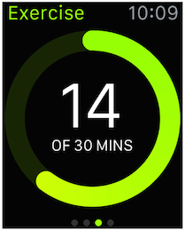
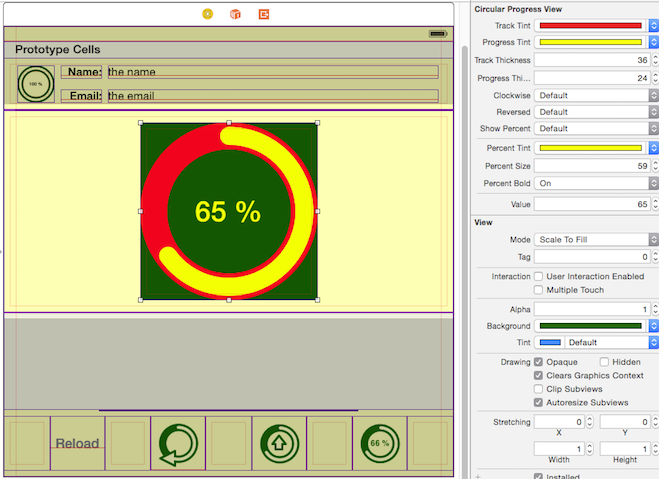
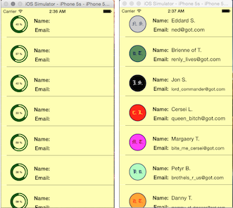

# Circular Progress View
A customisable `Swift` class for a progress view similar to what the _Apple Watch_ has.

## IMPORTANT
2016.12.03: This project has been **deprecated** for the time being as it uses Swift 1.2 and I don't intend to update it any time soon. It's still useful as a learning resource but that's about it for now.

## Motivation
You may have seen that the _Apple Watch_ has some cool new progress views, like this:

Image from [_Apple Watch Human Interface Guidelines_](https://developer.apple.com/library/prerelease/ios/documentation/UserExperience/Conceptual/WatchHumanInterfaceGuidelines/index.html#//apple_ref/doc/uid/TP40014992-CH3-SW1)

I wanted to create something similar and this project is the result of that effort.

## API

You use a `CircularProgressView` much like you'd use a regular `UIProgressView`. You instantiate a `CircularProgressView` either directly on _Interface Builder_ or programmatically. The class supports IB rendering so when you instantiate it directly on IB, you can manipulate its parameters from an inspector, with immediate feedback.

You can customize:

* the **track tint**: The color of the full track.
* the **progress tint**: The color of the portion of the track that represents the progress made.
* the **track thickness**: The thickness (in points) of the full track.
* the **progress thickness**: The thickness (in points) of the portion of the track that represents the progress made. There's also another way to set or change the progress thickness but you can only do it programmatically. See the source file for details.
* the **direction of rotation**: Whether the progress track grows clockwise or counterclockwise.
* the **mode of progress**: Whether the view displays the progress itself (_regular_ mode) or what's left of it (_reversed_ mode).
* whether or not to display a label showing the percentage of completion (_regular_ mode) or the percentage of what's left to complete (_reversed_ mode). The label is optional, automatically created if necessary, and you can customise it in many ways. Also, it automatically makes sure that the text is not going to be too large.
* the **percentage tint**: The color of the percentage text shown by the label.
* the **percentage font size**: The font size of the percentage text shown by the label.
* whether or not to display the percentage text using the bold system font (as opposed to the regular system font). Note that although you can't change the actual font of the label through IB, you can do so programmatically by accessing the label and costumising it to your liking.
* the **progress value** displayed by the progress view. This is what you'd play with in IB to see how your other customisation choices feel like. In IB, the values you enter in the inspector are integers interpreted as percentages but, programmatically, you'd set the values using `CGFloat`s in the range [0,1].

Of course, being a subclass of `UIView`, you can also customise the progress view's **background color**.

## How to install:

Just copy the source file `CircularProgressView.swift` into your project. That's it. No frameworks.

## Requirements:

I wrote this using **Xcode 6.3 (6D570)** and **Swift 1.2**.

## Demo app:

I've added a demo app showing `CircularProgressView` in action on a typical scenario. All the app does is pretend to download information about characters from _Game of Thrones_. Of course, there's no actual downloading of anything; the data is all hardcoded into the app itself and the app simply counts until some number before it displays the data. Yes, the avatars are ugly. I originally wanted to have images from [this page](http://gameofthrones.wikia.com/wiki/Category:Characters) but then I'd be incurring on copyright violation so I opted for creating them myself. As you can see, I'm a great artist.

The demo app lets you play with the various options (other than color and thickness) by tapping on the corresponding buttons: **clockwise**/**counterclockwise**, **normal**/**reversed mode**, and **show**/**hide percentage** labels. The **Reload** button, well, reloads everything. The buttons affect all the progress views at once.

## Creator

That would be me, _Wagner Truppel_. If you need or want to contact me, send a message to `wagner` at `restlessbrain` dot com.

## License:

I'm sharing this work under the **MIT License**. See the LICENSE file for more information
